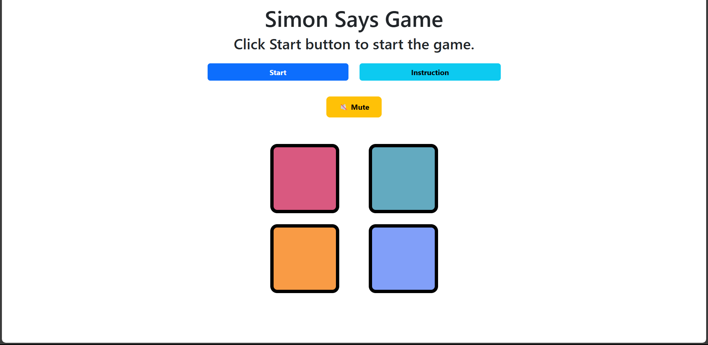

# 🎮 Simon Says Game

A colorful and interactive memory game inspired by the classic **Simon Says**, built using **HTML**, **CSS**, and **JavaScript**. Responsive design powered by **Bootstrap 5**, with smooth visuals and sound feedback to enhance the gameplay experience.

---

## 🌐 Live Demo

🔗 [Play the Game Now](https://simon-say-game-clone.netlify.app/)

---

## 📸 Game Preview



---

## 🧠 How to Play

1. Click the **Start** button to begin.
2. Watch the **sequence** of flashing colored boxes.
3. Repeat the same sequence by clicking the boxes **in the correct order**.
4. Each new level adds **one more color** to the sequence.
5. A wrong click ends the game and displays your **score** and **high score**.
6. Toggle game sounds using the **Mute/Unmute** button.
7. Click the **Instruction** button for in-game guidance.

---

## 🚀 Features

- 🎨 Colorful and responsive UI
- 🔊 Sound effects (gameplay, game over, high score)
- 💡 Instruction modal with gameplay tips
- 🏆 High score tracking (session-based)
- 📱 Mobile-friendly layout
- 🔇 Mute/unmute audio toggle
- ✨ Smooth transitions and visual effects

---

## 🛠️ Tech Stack

| Tech         | Role                      |
|--------------|---------------------------|
| HTML5        | Markup and structure      |
| CSS3         | Styling and animations    |
| JavaScript   | Game logic and interactivity |
| Bootstrap 5  | Grid system and modals    |
| Audio Files  | Game sounds               |

---

## 📁 Project Structure

```plaintext
Simon_Says_Game/
├── index.html             # Main HTML
├── simon_says.css         # Game styles
├── simon_says.js          # Game logic
├── assets/
│   └── preview.png        # Game preview image
├── sounds/
│   ├── victory.mp3
│   ├── perfect.mp3
│   └── game_over.wav
└── README.md              # You're here!
